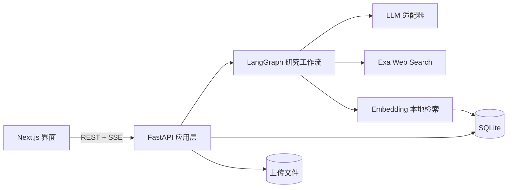

# ResearchFlow

ResearchFlow 是一个面向科研与技术预研的 AI 深度研究工作台。它能把开放式研究目标转成结构化计划，联合检索开放 Web 和用户选择的本地资料，保存来源、证据与关键主张，并展示可恢复、可追溯引用的研究过程。

项目的首个演示场景是：调研 AI 代码生成工具的现有评测方法，并产出一份可以实际执行的评测方案。

## 当前进度

仓库目前已经具备可重新打开、可追溯引用的网页与本地资料联合研究闭环：

- 在 Next.js Dashboard 创建任务，并在 Research Workspace 查看 SSE 实时进度；
- 使用 SQLite 持久化运行、事件、结构化计划、检索子任务、网页/本地来源、证据、知识文档元数据和报告；
- `simulation` 模式完全离线，`llm` 模式只生成真实计划；
- `langgraph` 模式执行规划、搜索、阅读、证据提取、写作和检查六个节点；
- 真实网页来源使用 Exa Search API 检索论文页面、官方文档、企业技术博客和其他公开网页；
- 中文研究问题与英文检索词分开保存，兼顾界面可读性和通用 Web 检索效果；
- 保存来源类型与可用元数据，建立 Claim—Evidence 关系并检查引用覆盖率；
- 前端展示研究计划、分类来源、关键主张、证据与可点击引用，刷新后仍可恢复；
- 运行中的任务可取消；失败任务可重新运行一次；历史记录可重命名、归档和删除；
- 运行页展示耗时、Token、来源构成、费用估算和引用覆盖率；
- 可选共享访问码通过 HttpOnly Cookie 保护全部研究与知识库 API，生产环境强制启用；
- Dashboard 可上传、选择、重处理和删除 PDF、Markdown、UTF-8 文本，本地引用保留页码或行号；
- 本地资料默认使用 Gemini Embedding 2 生成语义向量并以余弦相似度检索，向量保存在 SQLite，无需独立向量数据库或 GPU；
- 外部能力均有 Fake/Mock，常规测试不联网、不消耗模型额度；
- 后端、前端、Ruff、ESLint、生产构建和浏览器 E2E 纳入 GitHub Actions。

固定查询验证 Exa 足以覆盖当前黄金场景所需的学术、官方和工业资料，因此暂不额外接入学术 Provider。本地检索已经升级为真正的 Embedding 检索；DOI、OCR 和独立向量数据库仍属于按需增强能力。

## 开发路线图

核心研究闭环、可靠性、自动化测试和作品集交付已经完成。项目默认在本地运行并通过共享屏幕演示；Docker 与在线部署都是可选增强。当前产品和技术文档见[文档索引](docs/README.md)。

## 技术栈

- Next.js 16、React 19、TypeScript、Tailwind CSS
- FastAPI、Python 3.12、SQLAlchemy、SQLite
- LangGraph `StateGraph`
- REST API 与 Server-Sent Events（SSE）
- HTTPX、Exa Search API
- OpenAI-compatible JSON Schema 结构化输出
- pypdf 文本层解析、Gemini/OpenAI-compatible Embedding 与 SQLite 向量存储
- ResearchFlow 自有 `ResearchWorkflow`、`LLMClient`、`SearchProvider`、`WebPageReader` 与 `KnowledgeRetriever` 接口

## 架构



LangGraph、供应商 SDK 和持久化细节都位于自有接口之后；前端只依赖 ResearchFlow 的 REST、SSE 和领域状态。

## 仓库结构

```text
apps/web       Next.js 前端
apps/api       FastAPI 后端
docs           使用、产品、架构、评测和学习文档
examples       可公开使用的演示输入
scripts        可重复运行的质量评测与开发辅助脚本
var            本地运行数据（不提交到 Git）
```

## 本地启动

需要 Git、Node.js 20.9+、npm、uv 和 Python 3.12；支持 Windows、Linux 和 macOS，不需要 Docker、Redis、GPU 或本地大模型。

在仓库根目录打开终端（下面以 PowerShell 为例）：

```powershell
uv sync --package researchflow-api
Copy-Item .env.example .env
npm install --prefix apps/web
```

Linux 或 macOS 将第二行改为 `cp .env.example .env`。

然后分别启动后端和前端：

后端终端：

```powershell
uv run --package researchflow-api python -m uvicorn researchflow.main:app --app-dir apps/api/src --host 127.0.0.1 --port 8000 --reload
```

前端终端：

```powershell
npm --prefix apps/web run dev -- --hostname 127.0.0.1
```

访问 [http://localhost:3000](http://localhost:3000)。完整测试命令和排错方式见[使用、开发与运维手册](docs/guides/development-and-operations.md)。

## 配置与安全

请从 `.env.example` 复制本地配置，不要提交真实 API Key、访问令牌或个人资料。

默认 `simulation` 模式不需要外部服务。真实联合研究需要在 `.env` 中配置 LLM、Exa 和 Embedding；变量含义及示例见 [`.env.example`](.env.example) 和[使用、开发与运维手册](docs/guides/development-and-operations.md)。真实密钥不得提交到 Git。

知识文档默认保存在 `var/uploads`，支持 PDF、Markdown 和 UTF-8 纯文本。PDF 仅解析已有文本层，不含 OCR；文档片段会发送给 Embedding 服务，命中片段还会交给 LLM，使用私人文件前应同时确认两个供应商的数据政策。Embedding 配置变更后需要在页面重新处理已有文档。

## 项目文档

按“使用与部署、产品、架构、评测、学习”分类的入口见[文档索引](docs/README.md)。日常启动和排错直接阅读[使用、开发与运维手册](docs/guides/development-and-operations.md)，演示与简历表达见[作品集展示材料](docs/product/portfolio-presentation.md)；仓库还提供[黄金演示输入](examples/ai-code-generation-evaluation.md)和[示例报告](examples/ai-code-generation-evaluation-result.md)。

## 许可证

本项目使用 [MIT License](LICENSE)。
